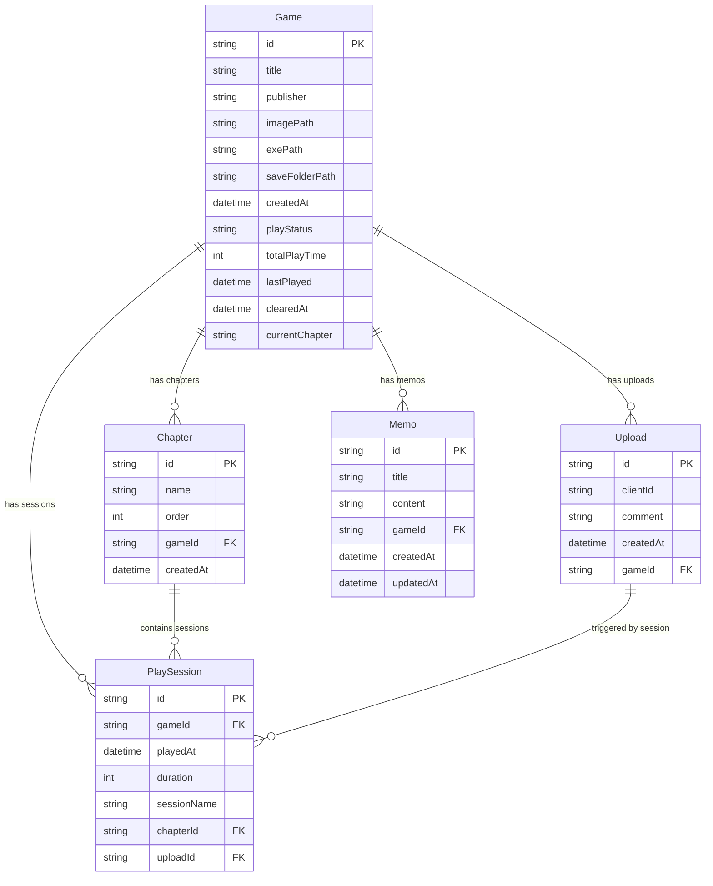

# CloudLaunch データベース仕様書

## 目次

1. [概要](#概要)
2. [データベース設計方針](#データベース設計方針)
3. [テーブル構造](#テーブル構造)
4. [リレーションシップ](#リレーションシップ)
5. [インデックス戦略](#インデックス戦略)
6. [データ型とNull許可ポリシー](#データ型とNull許可ポリシー)
7. [制約条件](#制約条件)
8. [マイグレーション履歴](#マイグレーション履歴)
9. [パフォーマンス最適化](#パフォーマンス最適化)
10. [バックアップとリストア](#バックアップとリストア)
11. [データ整合性](#データ整合性)
12. [運用・保守](#運用保守)

## 概要

CloudLaunchは、SQLiteを使用したローカルデータベースでゲーム管理、プレイセッション記録、章別進捗管理、クラウド同期履歴を管理します。

### 技術スタック

- **データベース**: SQLite 3
- **ORM**: Prisma 6.11.0
- **マイグレーション**: Prisma Migrate
- **型生成**: Prisma Client

### データベースファイル配置

- **開発環境**: `dev.db`
- **本番環境**: `out/app.db`（アプリケーション配布時）

## データベース設計方針

### 1. 正規化

- 第3正規形を基準とした設計
- 適切な関連付けによるデータ重複の排除
- パフォーマンスを考慮した非正規化の許容

### 2. 拡張性

- 将来的な機能追加を考慮したスキーマ設計
- カラム追加時の互換性確保
- 段階的マイグレーション対応

### 3. データ整合性

- 外部キー制約による参照整合性
- CHECK制約による値域制限
- トランザクション処理による整合性保証

### 4. パフォーマンス

- 適切なインデックス設計
- クエリパフォーマンスを考慮したテーブル設計
- N+1問題の回避

## テーブル構造

### 1. Game テーブル

#### 概要

ゲーム基本情報とプレイ統計を管理

#### スキーマ

```sql
CREATE TABLE "Game" (
    "id" TEXT NOT NULL PRIMARY KEY DEFAULT (uuid()),
    "title" TEXT NOT NULL,
    "publisher" TEXT NOT NULL,
    "imagePath" TEXT,
    "exePath" TEXT NOT NULL,
    "saveFolderPath" TEXT,
    "createdAt" DATETIME NOT NULL DEFAULT CURRENT_TIMESTAMP,
    "playStatus" TEXT NOT NULL DEFAULT 'unplayed',
    "totalPlayTime" INTEGER NOT NULL DEFAULT 0,
    "lastPlayed" DATETIME,
    "clearedAt" DATETIME,
    "currentChapter" TEXT
);
```

#### カラム定義

| カラム名       | データ型 | Null許可 | デフォルト値      | 説明                       |
| -------------- | -------- | -------- | ----------------- | -------------------------- |
| id             | TEXT     | NO       | uuid()            | ゲームの一意識別子         |
| title          | TEXT     | NO       | -                 | ゲームタイトル             |
| publisher      | TEXT     | NO       | -                 | 出版社・開発元             |
| imagePath      | TEXT     | YES      | NULL              | ゲーム画像のファイルパス   |
| exePath        | TEXT     | NO       | -                 | 実行ファイルのパス         |
| saveFolderPath | TEXT     | YES      | NULL              | セーブデータフォルダのパス |
| createdAt      | DATETIME | NO       | CURRENT_TIMESTAMP | 登録日時                   |
| playStatus     | TEXT     | NO       | 'unplayed'        | プレイステータス（enum）   |
| totalPlayTime  | INTEGER  | NO       | 0                 | 総プレイ時間（秒）         |
| lastPlayed     | DATETIME | YES      | NULL              | 最終プレイ日時             |
| clearedAt      | DATETIME | YES      | NULL              | クリア日時                 |
| currentChapter | TEXT     | YES      | NULL              | 現在プレイ中の章ID         |

#### PlayStatus Enum

```typescript
enum PlayStatus {
  unplayed = "未プレイ"
  playing = "プレイ中"
  played = "プレイ済み"
}
```

**注意**: 実際のPrismaスキーマでは以下の値が使用されています：

- `unplayed` (小文字)
- `playing` (小文字)
- `played` (小文字)

#### インデックス

```sql
CREATE INDEX "idx_games_title" ON "Game"("title");
CREATE INDEX "idx_games_publisher" ON "Game"("publisher");
CREATE INDEX "idx_games_play_status" ON "Game"("playStatus");
CREATE INDEX "idx_games_last_played" ON "Game"("lastPlayed");
```

### 2. PlaySession テーブル

#### 概要

個別のプレイセッション記録を管理

#### スキーマ

```sql
CREATE TABLE "PlaySession" (
    "id" TEXT NOT NULL PRIMARY KEY DEFAULT (uuid()),
    "gameId" TEXT NOT NULL,
    "playedAt" DATETIME NOT NULL DEFAULT CURRENT_TIMESTAMP,
    "duration" INTEGER NOT NULL,
    "sessionName" TEXT,
    "chapterId" TEXT,
    "uploadId" TEXT,
    FOREIGN KEY ("gameId") REFERENCES "Game"("id") ON DELETE CASCADE ON UPDATE CASCADE,
    FOREIGN KEY ("chapterId") REFERENCES "Chapter"("id") ON DELETE SET NULL ON UPDATE CASCADE,
    FOREIGN KEY ("uploadId") REFERENCES "Upload"("id") ON DELETE SET NULL ON UPDATE CASCADE
);
```

#### カラム定義

| カラム名    | データ型 | Null許可 | デフォルト値      | 説明                           |
| ----------- | -------- | -------- | ----------------- | ------------------------------ |
| id          | TEXT     | NO       | uuid()            | セッションの一意識別子         |
| gameId      | TEXT     | NO       | -                 | 関連ゲームID（外部キー）       |
| playedAt    | DATETIME | NO       | CURRENT_TIMESTAMP | プレイ開始日時                 |
| duration    | INTEGER  | NO       | -                 | プレイ時間（秒）               |
| sessionName | TEXT     | YES      | NULL              | セッション名（手動記録時）     |
| chapterId   | TEXT     | YES      | NULL              | 関連章ID（外部キー）           |
| uploadId    | TEXT     | YES      | NULL              | 関連アップロードID（外部キー） |

#### インデックス

```sql
CREATE INDEX "idx_playsessions_gameid" ON "PlaySession"("gameId");
CREATE INDEX "idx_playsessions_played_at" ON "PlaySession"("playedAt");
CREATE INDEX "idx_playsessions_chapter_id" ON "PlaySession"("chapterId");
CREATE INDEX "idx_playsessions_duration" ON "PlaySession"("duration");
```

### 3. Chapter テーブル

#### 概要

ゲーム内の章・ステージ管理

#### スキーマ

```sql
CREATE TABLE "Chapter" (
    "id" TEXT NOT NULL PRIMARY KEY DEFAULT (uuid()),
    "name" TEXT NOT NULL,
    "order" INTEGER NOT NULL,
    "gameId" TEXT NOT NULL,
    "createdAt" DATETIME NOT NULL DEFAULT CURRENT_TIMESTAMP,
    FOREIGN KEY ("gameId") REFERENCES "Game"("id") ON DELETE CASCADE ON UPDATE CASCADE,
    UNIQUE("gameId", "order"),
    UNIQUE("gameId", "name")
);
```

#### カラム定義

| カラム名  | データ型 | Null許可 | デフォルト値      | 説明                     |
| --------- | -------- | -------- | ----------------- | ------------------------ |
| id        | TEXT     | NO       | uuid()            | 章の一意識別子           |
| name      | TEXT     | NO       | -                 | 章名                     |
| order     | INTEGER  | NO       | -                 | 表示順序                 |
| gameId    | TEXT     | NO       | -                 | 関連ゲームID（外部キー） |
| createdAt | DATETIME | NO       | CURRENT_TIMESTAMP | 作成日時                 |

#### 制約条件

- `UNIQUE(gameId, order)`: 同一ゲーム内での順序重複防止
- `UNIQUE(gameId, name)`: 同一ゲーム内での章名重複防止

#### インデックス

```sql
CREATE INDEX "idx_chapters_gameid_order" ON "Chapter"("gameId", "order");
CREATE INDEX "idx_chapters_name" ON "Chapter"("name");
```

### 4. Upload テーブル

#### 概要

クラウドアップロード履歴管理

#### スキーマ

```sql
CREATE TABLE "Upload" (
    "id" TEXT NOT NULL PRIMARY KEY DEFAULT (uuid()),
    "clientId" TEXT,
    "comment" TEXT NOT NULL,
    "createdAt" DATETIME NOT NULL DEFAULT CURRENT_TIMESTAMP,
    "gameId" TEXT NOT NULL,
    FOREIGN KEY ("gameId") REFERENCES "Game"("id") ON DELETE CASCADE ON UPDATE CASCADE
);
```

#### カラム定義

| カラム名  | データ型 | Null許可 | デフォルト値      | 説明                           |
| --------- | -------- | -------- | ----------------- | ------------------------------ |
| id        | TEXT     | NO       | uuid()            | アップロードの一意識別子       |
| clientId  | TEXT     | YES      | NULL              | クライアント識別符（PC識別用） |
| comment   | TEXT     | NO       | -                 | アップロード時のコメント       |
| createdAt | DATETIME | NO       | CURRENT_TIMESTAMP | アップロード日時               |
| gameId    | TEXT     | NO       | -                 | 関連ゲームID（外部キー）       |

#### インデックス

```sql
CREATE INDEX "idx_uploads_gameid" ON "Upload"("gameId");
CREATE INDEX "idx_uploads_created_at" ON "Upload"("createdAt");
CREATE INDEX "idx_uploads_client_id" ON "Upload"("clientId");
```

### 5. Memo テーブル

#### 概要

ゲームプレイメモの管理

#### スキーマ

```sql
CREATE TABLE "Memo" (
    "id" TEXT NOT NULL PRIMARY KEY DEFAULT (uuid()),
    "title" TEXT NOT NULL,
    "content" TEXT NOT NULL,
    "gameId" TEXT NOT NULL,
    "createdAt" DATETIME NOT NULL DEFAULT CURRENT_TIMESTAMP,
    "updatedAt" DATETIME NOT NULL,
    FOREIGN KEY ("gameId") REFERENCES "Game"("id") ON DELETE CASCADE ON UPDATE CASCADE
);
```

#### カラム定義

| カラム名  | データ型 | Null許可 | デフォルト値      | 説明                     |
| --------- | -------- | -------- | ----------------- | ------------------------ |
| id        | TEXT     | NO       | uuid()            | メモの一意識別子         |
| title     | TEXT     | NO       | -                 | メモタイトル             |
| content   | TEXT     | NO       | -                 | メモ内容（Markdown形式） |
| gameId    | TEXT     | NO       | -                 | 関連ゲームID（外部キー） |
| createdAt | DATETIME | NO       | CURRENT_TIMESTAMP | 作成日時                 |
| updatedAt | DATETIME | NO       | -                 | 更新日時（自動更新）     |

#### 機能

- **Markdown対応**: contentフィールドはMarkdown形式をサポート
- **自動更新**: updatedAtは@updatedAtディレクティブで自動更新
- **ファイル連携**: ローカルファイルシステムとの同期機能
- **クラウド同期**: S3/R2ストレージとの同期対応

#### インデックス

```sql
CREATE INDEX "idx_memos_gameid" ON "Memo"("gameId");
CREATE INDEX "idx_memos_title" ON "Memo"("title");
CREATE INDEX "idx_memos_created_at" ON "Memo"("createdAt");
CREATE INDEX "idx_memos_updated_at" ON "Memo"("updatedAt");
```

## リレーションシップ

### ERD



### 1. Game → PlaySession (1:N)

- **関係**: 1つのゲームは複数のプレイセッションを持つ
- **削除動作**: `CASCADE` - ゲーム削除時に関連セッションも削除
- **ビジネスルール**: セッション合計時間でゲームの総プレイ時間を算出

### 2. Game → Chapter (1:N)

- **関係**: 1つのゲームは複数の章を持つ
- **削除動作**: `CASCADE` - ゲーム削除時に関連章も削除
- **ビジネスルール**: 各ゲームに必ず「その他」章（order: 0）が存在

### 3. Game → Upload (1:N)

- **関係**: 1つのゲームは複数のアップロード履歴を持つ
- **削除動作**: `CASCADE` - ゲーム削除時に関連アップロード履歴も削除

### 4. Chapter → PlaySession (1:N)

- **関係**: 1つの章は複数のプレイセッションを持つ
- **削除動作**: `SET NULL` - 章削除時にセッションの`chapterId`をNULLに設定

### 5. Upload → PlaySession (1:N)

- **関係**: 1つのアップロードは複数のプレイセッションと関連付け可能
- **削除動作**: `SET NULL` - アップロード削除時にセッションの`uploadId`をNULLに設定

### 6. Game → Memo (1:N)

- **関係**: 1つのゲームは複数のメモを持つ
- **削除動作**: `CASCADE` - ゲーム削除時に関連メモも削除
- **特徴**: メモはゲーム固有で、独立して存在しない

## インデックス戦略

### 1. プライマリインデックス

- 全テーブルでUUID型の主キーを使用
- SQLiteのROWIDを活用した効率的なアクセス

### 2. セカンダリインデックス

#### 検索最適化

```sql
-- ゲーム検索用
CREATE INDEX "idx_games_title" ON "Game"("title");
CREATE INDEX "idx_games_publisher" ON "Game"("publisher");

-- プレイセッション検索用
CREATE INDEX "idx_playsessions_gameid_played_at" ON "PlaySession"("gameId", "playedAt");
```

#### ソート最適化

```sql
-- ゲーム一覧表示用
CREATE INDEX "idx_games_last_played_desc" ON "Game"("lastPlayed" DESC);
CREATE INDEX "idx_games_total_play_time_desc" ON "Game"("totalPlayTime" DESC);

-- セッション履歴表示用
CREATE INDEX "idx_playsessions_played_at_desc" ON "PlaySession"("playedAt" DESC);
```

#### 複合インデックス

```sql
-- 章の順序管理用
CREATE INDEX "idx_chapters_gameid_order" ON "Chapter"("gameId", "order");

-- セッション統計用
CREATE INDEX "idx_playsessions_gameid_chapterid" ON "PlaySession"("gameId", "chapterId");
```

### 3. インデックス利用クエリ例

#### ゲーム検索

```sql
-- タイトル検索（idx_games_title使用）
SELECT * FROM "Game" WHERE "title" LIKE '%search%';

-- 最近プレイしたゲーム順（idx_games_last_played_desc使用）
SELECT * FROM "Game" ORDER BY "lastPlayed" DESC LIMIT 10;
```

#### セッション統計

```sql
-- ゲーム別総プレイ時間（idx_playsessions_gameid使用）
SELECT "gameId", SUM("duration") as total_time
FROM "PlaySession"
WHERE "gameId" = ?
GROUP BY "gameId";

-- 章別プレイ統計（idx_playsessions_gameid_chapterid使用）
SELECT "chapterId", COUNT(*) as session_count, SUM("duration") as total_time
FROM "PlaySession"
WHERE "gameId" = ?
GROUP BY "chapterId";
```

## データ型とNull許可ポリシー

### 1. データ型選択基準

#### TEXT型

- **用途**: 文字列データ全般
- **利点**: SQLiteの動的型付けによる柔軟性
- **制限**: 最大長制限なし（実用上は問題なし）

#### INTEGER型

- **用途**: 数値データ（時間、順序等）
- **範囲**: -9223372036854775808 〜 9223372036854775807
- **精度**: 64bit整数

#### DATETIME型

- **実装**: TEXT型として格納（ISO 8601形式）
- **形式**: `YYYY-MM-DD HH:MM:SS.SSS`
- **タイムゾーン**: UTC基準

### 2. Null許可ポリシー

#### NOT NULL必須項目

- 主キー（`id`）
- 外部キー（関連必須）
- ビジネス上必須項目（`title`, `publisher`, `exePath`等）

#### NULL許可項目

- オプション項目（`imagePath`, `saveFolderPath`）
- 状態依存項目（`lastPlayed`, `clearedAt`）
- 関連任意項目（`chapterId`, `uploadId`）

#### NULL vs 空文字の使い分け

```sql
-- NULL: 値が設定されていない、または該当しない
"imagePath" TEXT NULL

-- 空文字禁止: 必須項目は空文字も禁止
CHECK ("title" != '')
CHECK ("publisher" != '')
```

## 制約条件

### 1. プライマリキー制約

```sql
-- 全テーブル共通
"id" TEXT NOT NULL PRIMARY KEY DEFAULT (uuid())
```

### 2. 外部キー制約

```sql
-- PlaySession → Game
FOREIGN KEY ("gameId") REFERENCES "Game"("id") ON DELETE CASCADE

-- Chapter → Game
FOREIGN KEY ("gameId") REFERENCES "Game"("id") ON DELETE CASCADE

-- PlaySession → Chapter
FOREIGN KEY ("chapterId") REFERENCES "Chapter"("id") ON DELETE SET NULL
```

### 3. 一意制約

```sql
-- Chapter: 同一ゲーム内での順序・名前の重複防止
UNIQUE("gameId", "order")
UNIQUE("gameId", "name")
```

### 4. チェック制約

```sql
-- プレイ時間は正の値
CHECK ("duration" >= 0)
CHECK ("totalPlayTime" >= 0)

-- 章の順序は0以上
CHECK ("order" >= 0)

-- 空文字禁止
CHECK ("title" != '')
CHECK ("publisher" != '')
CHECK ("exePath" != '')
```

### 5. デフォルト値制約

```sql
-- 共通
DEFAULT (uuid())
DEFAULT CURRENT_TIMESTAMP

-- ビジネスロジック固有
DEFAULT 'unplayed'
DEFAULT 0
```

## マイグレーション履歴

### マイグレーション管理方針

- 後方互換性の維持
- 段階的な構造変更
- データ移行の安全性確保

### 主要マイグレーション履歴

#### 20250630003905_init

- 初期スキーマ作成
- Game, PlaySession, Upload テーブル作成

#### 20250630010806_make_fields_nullable

- オプション項目のNULL許可設定
- `imagePath`, `saveFolderPath`をNULL許可

#### 20250630023707_add_play_status

- `playStatus` enum追加
- デフォルト値設定

#### 20250701025922_change_folder_path_to_save_folder_path

- カラム名変更: `folderPath` → `saveFolderPath`
- 意味の明確化

#### 20250704044235_change_id_uuid

- 主キーをINTからUUIDに変更
- より安全な識別子

#### 20250707015131_add_chapter_management

- Chapter テーブル追加
- 章別プレイ管理機能

#### 20250707074413_add_process_name_to_session

- プロセス名記録機能追加（後に削除）

#### 20250707082816_rename_process_name_to_session_name

- `processName` → `sessionName`に変更
- より汎用的な命名

#### 20250709013040_add_cleared_at

- `clearedAt`カラム追加
- クリア日時記録機能

### マイグレーション実行手順

#### 開発環境

```bash
# マイグレーション作成
npx prisma migrate dev --name migration_name

# マイグレーション適用
npx prisma migrate deploy
```

#### 本番環境

```bash
# 本番データベースURLを設定
export DATABASE_URL="file:../out/app.db"

# マイグレーション適用
npx prisma migrate deploy

# Prismaクライアント再生成
npx prisma generate
```

## パフォーマンス最適化

### 1. クエリ最適化

#### EXPLAIN QUERY PLANの活用

```sql
-- インデックス使用状況確認
EXPLAIN QUERY PLAN
SELECT * FROM "Game" WHERE "title" LIKE '%search%';
```

#### 効率的なJOIN

```sql
-- 適切なインデックスを使用したJOIN
SELECT g.*, COUNT(ps.id) as session_count
FROM "Game" g
LEFT JOIN "PlaySession" ps ON g.id = ps.gameId
GROUP BY g.id;
```

### 2. ページネーション

```sql
-- OFFSET/LIMITによるページネーション
SELECT * FROM "Game"
ORDER BY "lastPlayed" DESC
LIMIT 20 OFFSET 40;

-- カーソルベースページネーション（より効率的）
SELECT * FROM "Game"
WHERE "lastPlayed" < ?
ORDER BY "lastPlayed" DESC
LIMIT 20;
```

### 3. 集計クエリ最適化

```sql
-- 事前計算による高速化
UPDATE "Game"
SET "totalPlayTime" = (
  SELECT COALESCE(SUM("duration"), 0)
  FROM "PlaySession"
  WHERE "gameId" = "Game"."id"
);
```

### 4. インデックスメンテナンス

```sql
-- インデックス利用状況確認
PRAGMA index_info('idx_games_title');

-- 統計情報更新
ANALYZE;
```

## バックアップとリストア

### 1. データベースバックアップ

#### 完全バックアップ

```bash
# SQLiteファイルの物理コピー
cp app.db app_backup_$(date +%Y%m%d_%H%M%S).db

# SQLダンプ
sqlite3 app.db .dump > app_backup_$(date +%Y%m%d_%H%M%S).sql
```

#### 差分バックアップ

```sql
-- 最終バックアップ以降の変更分
SELECT * FROM "Game" WHERE "createdAt" > '2024-01-01';
SELECT * FROM "PlaySession" WHERE "playedAt" > '2024-01-01';
```

### 2. データエクスポート/インポート

#### CSV形式エクスポート

```sql
.mode csv
.output games_export.csv
SELECT * FROM "Game";
.output stdout
```

#### JSON形式（Prismaクライアント使用）

```typescript
// エクスポート
const games = await prisma.game.findMany({
  include: {
    sessions: true,
    chapters: true,
    uploads: true
  }
})
fs.writeFileSync("backup.json", JSON.stringify(games, null, 2))

// インポート
const backupData = JSON.parse(fs.readFileSync("backup.json", "utf8"))
for (const game of backupData) {
  await prisma.game.create({
    data: game
  })
}
```

### 3. 災害復旧手順

1. **バックアップファイル確認**
2. **データベースファイル復元**
3. **整合性チェック実行**
4. **アプリケーション動作確認**

## データ整合性

### 1. 参照整合性

```sql
-- 外部キー制約の有効化
PRAGMA foreign_keys = ON;

-- 参照整合性チェック
PRAGMA foreign_key_check;
```

### 2. データ検証クエリ

#### 孤立レコード検出

```sql
-- 存在しないゲームを参照するセッション
SELECT ps.* FROM "PlaySession" ps
LEFT JOIN "Game" g ON ps.gameId = g.id
WHERE g.id IS NULL;

-- 存在しない章を参照するセッション
SELECT ps.* FROM "PlaySession" ps
LEFT JOIN "Chapter" c ON ps.chapterId = c.id
WHERE ps.chapterId IS NOT NULL AND c.id IS NULL;

-- 存在しないゲームを参照するメモ
SELECT m.* FROM "Memo" m
LEFT JOIN "Game" g ON m.gameId = g.id
WHERE g.id IS NULL;
```

#### 集計値の整合性

```sql
-- ゲームの総プレイ時間とセッション合計の比較
SELECT
  g.id,
  g.totalPlayTime,
  COALESCE(SUM(ps.duration), 0) as calculated_total
FROM "Game" g
LEFT JOIN "PlaySession" ps ON g.id = ps.gameId
GROUP BY g.id
HAVING g.totalPlayTime != calculated_total;

-- メモの整合性チェック
SELECT
  g.id as gameId,
  g.title,
  COUNT(m.id) as memo_count
FROM "Game" g
LEFT JOIN "Memo" m ON g.id = m.gameId
GROUP BY g.id, g.title
ORDER BY memo_count DESC;
```

### 3. データクリーニング

#### 重複データ削除

```sql
-- 重複セッション削除（同一時刻・同一時間のセッション）
DELETE FROM "PlaySession"
WHERE rowid NOT IN (
  SELECT MIN(rowid)
  FROM "PlaySession"
  GROUP BY gameId, playedAt, duration
);
```

#### 無効データ修正

```sql
-- 負の値の修正
UPDATE "PlaySession" SET duration = 0 WHERE duration < 0;
UPDATE "Game" SET totalPlayTime = 0 WHERE totalPlayTime < 0;
```

## 運用・保守

### 1. 定期メンテナンス

#### 統計情報更新

```sql
-- 月次実行
ANALYZE;

-- テーブル最適化
VACUUM;
```

#### データベースファイルサイズ確認

```sql
-- ファイルサイズ情報
PRAGMA page_count;
PRAGMA page_size;
PRAGMA freelist_count;
```

### 2. パフォーマンス監視

#### スロークエリ検出

```typescript
// Prismaクライアントでのクエリログ
const prisma = new PrismaClient({
  log: [
    { level: "query", emit: "event" },
    { level: "error", emit: "stdout" }
  ]
})

prisma.$on("query", (e) => {
  if (e.duration > 1000) {
    // 1秒以上のクエリ
    console.log("Slow query detected:", e)
  }
})
```

#### 接続プール監視

```typescript
// 接続状況確認
console.log("Active connections:", process.env.DATABASE_URL)
```

### 3. データベースアップグレード手順

1. **現在のデータベースバックアップ**
2. **マイグレーション計画作成**
3. **テスト環境での実行確認**
4. **本番環境でのマイグレーション実行**
5. **動作確認とロールバック準備**

### 4. トラブルシューティング

#### よくある問題と解決方法

##### データベースロック

```bash
# プロセス確認
lsof app.db

# 強制的なロック解除（注意が必要）
sqlite3 app.db "BEGIN IMMEDIATE; ROLLBACK;"
```

##### 破損データベース修復

```sql
-- 整合性チェック
PRAGMA integrity_check;

-- 修復試行
PRAGMA quick_check;
```

##### マイグレーションエラー

```bash
# マイグレーション状態確認
npx prisma migrate status

# 手動マイグレーション修正
npx prisma migrate resolve --rolled-back "migration_name"
```

## セキュリティ考慮事項

### 1. ファイルアクセス権限

```bash
# データベースファイルの適切な権限設定
chmod 600 app.db
```

### 2. SQLインジェクション対策

```typescript
// Prismaクライアントは自動的にサニタイズを実行
const games = await prisma.game.findMany({
  where: {
    title: {
      contains: userInput // 自動エスケープ
    }
  }
})

// 生SQLを使用する場合の注意
await prisma.$queryRaw`SELECT * FROM Game WHERE title = ${userInput}`
```

### 3. データ暗号化

```typescript
// 機密データの暗号化（将来的な実装）
const encryptedData = encrypt(sensitiveData, encryptionKey)
```

## まとめ

このデータベース仕様書は、CloudLaunchのデータ管理基盤を詳細に定義しています。以下の点に注意して運用してください：

### 重要なポイント

1. **外部キー制約の有効化**: データ整合性確保のため必須
2. **定期的なバックアップ**: データ損失防止のため
3. **インデックスの適切な使用**: パフォーマンス維持のため
4. **マイグレーションの慎重な実行**: 後方互換性確保のため

### 今後の拡張性

- マルチユーザー対応
- クラウドデータベース移行
- パフォーマンス要件の変化への対応
- セキュリティ要件の強化

定期的にこの仕様書を見直し、システムの成長に合わせてアップデートしてください。
