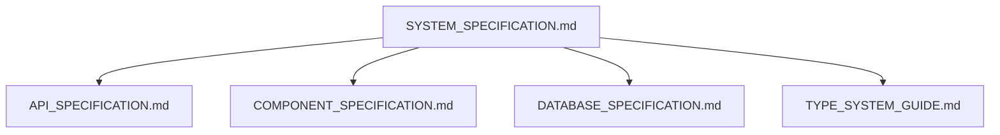
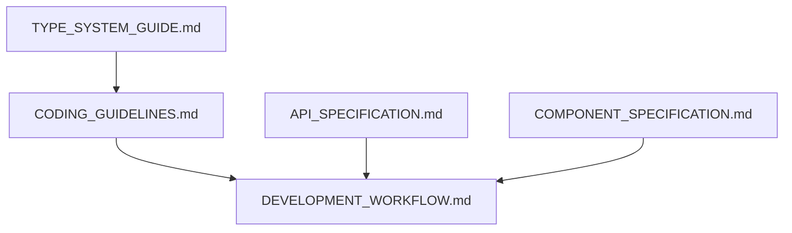

# CloudLaunch ドキュメント索引

このドキュメントは、CloudLaunchプロジェクトの全ドキュメントの構造と関係を整理します。

## ドキュメント構造

```
docs/
├── DOCUMENTATION_INDEX.md     # このファイル - 全体の索引・ナビゲーション
├── TYPE_SYSTEM_GUIDE.md       # 型システム運用ガイド
├── SYSTEM_SPECIFICATION.md    # システム全体仕様
├── API_SPECIFICATION.md       # IPC API詳細仕様
├── COMPONENT_SPECIFICATION.md # フロントエンドコンポーネント仕様
├── DATABASE_SPECIFICATION.md  # データベース設計仕様
├── CODING_GUIDELINES.md       # コーディング規約・ベストプラクティス
└── DEVELOPMENT_WORKFLOW.md    # 開発ワークフロー・実装ガイド
```

## ドキュメント間の関係

### 設計・仕様レベル



### 開発・実装レベル



## 用途別ドキュメント選択ガイド

### 🚀 プロジェクト概要を知りたい

**→ [SYSTEM_SPECIFICATION.md](./SYSTEM_SPECIFICATION.md)**

- システム全体のアーキテクチャ
- 技術スタック（**メモ機能対応技術含む**）
- 主要機能の概要（**プレイメモ機能追加**）

### 💻 コーディングルールを確認したい

**→ [CODING_GUIDELINES.md](./CODING_GUIDELINES.md)**

- 命名規約
- ファイル構成規約
- **Import順序規約（ESLint設定更新済み）**
- **Markdown記法規約（メモ機能用）**
- エラーハンドリング規約
- セキュリティガイドライン

### 🛠️ 新機能を実装したい

**→ [DEVELOPMENT_WORKFLOW.md](./DEVELOPMENT_WORKFLOW.md)**

- 機能別実装ガイド
- ファイル配置ガイド
- **メモ機能実装例（実際の実装済み機能）**
- 実装例とベストプラクティス

### 🏗️ 型システムを理解・活用したい

**→ [TYPE_SYSTEM_GUIDE.md](./TYPE_SYSTEM_GUIDE.md)**

- TypeScript型運用方針
- 共通型定義
- **メモ関連型定義（memo.d.ts）**
- **Zodバリデーション統合**
- 型安全なコーディングパターン

### 🔗 API仕様を確認したい

**→ [API_SPECIFICATION.md](./API_SPECIFICATION.md)**

- IPC通信エンドポイント一覧
- **メモ管理API（CRUD + クラウド同期）**
- パラメータ・戻り値詳細
- エラーハンドリングパターン

### 🎨 UIコンポーネントを理解・作成したい

**→ [COMPONENT_SPECIFICATION.md](./COMPONENT_SPECIFICATION.md)**

- React コンポーネント設計原則
- **メモページ・コンポーネント（MemoCreate, MemoEditor等）**
- **新しいUIコンポーネント（DynamicImage, ConfirmModal等）**
- 再利用可能コンポーネント仕様
- カスタムフック・状態管理

### 🗄️ データベース設計を理解したい

**→ [DATABASE_SPECIFICATION.md](./DATABASE_SPECIFICATION.md)**

- テーブル構造・リレーションシップ
- **Memoテーブル設計（ゲームとの1:N関係）**
- インデックス戦略
- パフォーマンス最適化

### 📝 メモ機能を理解・拡張したい 🆕

**→ 複数ドキュメント参照推奨**

- **概要**: [SYSTEM_SPECIFICATION - プレイメモ機能](./SYSTEM_SPECIFICATION.md#5-プレイメモ機能)
- **実装例**: [DEVELOPMENT_WORKFLOW - メモ機能実装例](./DEVELOPMENT_WORKFLOW.md#新機能実装例メモ管理機能実装済み)
- **API**: [API_SPECIFICATION - メモ管理API](./API_SPECIFICATION.md#メモ管理API)
- **DB**: [DATABASE_SPECIFICATION - Memoテーブル](./DATABASE_SPECIFICATION.md#5-memo-テーブル)
- **UI**: [COMPONENT_SPECIFICATION - メモページ](./COMPONENT_SPECIFICATION.md#4-memolist)

## 学習・理解の推奨順序

### 新規参加者（初回理解）

1. **[SYSTEM_SPECIFICATION.md](./SYSTEM_SPECIFICATION.md)** - プロジェクト全体像
2. **[CODING_GUIDELINES.md](./CODING_GUIDELINES.md)** - 開発ルール
3. **[TYPE_SYSTEM_GUIDE.md](./TYPE_SYSTEM_GUIDE.md)** - 型システム
4. **[DEVELOPMENT_WORKFLOW.md](./DEVELOPMENT_WORKFLOW.md)** - 実装手順

### 既存開発者（機能開発時）

1. **[DEVELOPMENT_WORKFLOW.md](./DEVELOPMENT_WORKFLOW.md)** - 実装ガイド
2. **関連仕様書** - 該当機能の詳細仕様
3. **[CODING_GUIDELINES.md](./CODING_GUIDELINES.md)** - 規約確認

### 保守・運用担当者

1. **[SYSTEM_SPECIFICATION.md](./SYSTEM_SPECIFICATION.md)** - システム概要
2. **[DATABASE_SPECIFICATION.md](./DATABASE_SPECIFICATION.md)** - データ管理
3. **[API_SPECIFICATION.md](./API_SPECIFICATION.md)** - 通信仕様

## 各ドキュメントの責務と範囲

| ドキュメント                                            | 主な責務                         | 対象読者                     | 更新頻度                 | 最終更新   |
| ------------------------------------------------------- | -------------------------------- | ---------------------------- | ------------------------ | ---------- |
| [SYSTEM_SPECIFICATION](./SYSTEM_SPECIFICATION.md)       | システム全体設計・アーキテクチャ | 全開発者・PM                 | 低（大きな変更時）       | 2025-01-30 |
| [API_SPECIFICATION](./API_SPECIFICATION.md)             | IPC API詳細仕様                  | フロント・バックエンド開発者 | 中（新API追加時）        | 2025-01-30 |
| [COMPONENT_SPECIFICATION](./COMPONENT_SPECIFICATION.md) | UI コンポーネント設計            | フロントエンド開発者         | 中（新コンポーネント時） | 2025-01-30 |
| [DATABASE_SPECIFICATION](./DATABASE_SPECIFICATION.md)   | データベース設計・運用           | バックエンド開発者・DBA      | 低（スキーマ変更時）     | 2025-01-30 |
| [TYPE_SYSTEM_GUIDE](./TYPE_SYSTEM_GUIDE.md)             | TypeScript 型運用                | 全開発者                     | 低（型戦略変更時）       | 2025-01-30 |
| [CODING_GUIDELINES](./CODING_GUIDELINES.md)             | コーディング規約                 | 全開発者                     | 低（規約変更時）         | 2025-01-30 |
| [DEVELOPMENT_WORKFLOW](./DEVELOPMENT_WORKFLOW.md)       | 開発手順・実装ガイド             | 全開発者                     | 高（日常的に参照）       | 2025-01-30 |

## ドキュメント保守ルール

### 更新タイミング

- **機能追加時**: 該当する仕様書を同時に更新
- **アーキテクチャ変更時**: SYSTEM_SPECIFICATION を最初に更新
- **新しいコーディングパターン確立時**: CODING_GUIDELINES に追加

### 一貫性維持

- **専門用語**: 各ドキュメントで統一された用語を使用
- **コード例**: 実際のプロジェクトコードと整合性を保つ
- **リンク**: 関連ドキュメント間の相互参照を維持

### 品質保証

- 新しいドキュメント作成時は既存ドキュメントとの重複・矛盾をチェック
- 実装との乖離が生じていないか定期的にレビュー
- 実際の開発ワークフローと一致しているか検証

## よくある質問とドキュメント対応

| 質問                           | 参照ドキュメント            | セクション                 |
| ------------------------------ | --------------------------- | -------------------------- |
| どの技術を使っているの？       | SYSTEM_SPECIFICATION        | 技術スタック               |
| **メモ機能はどう実装する？**   | **DEVELOPMENT_WORKFLOW**    | **メモ機能実装例**         |
| **メモAPIの使い方は？**        | **API_SPECIFICATION**       | **メモ管理API**            |
| 新しいAPIを追加したい          | DEVELOPMENT_WORKFLOW        | 新機能実装例               |
| コンポーネントの作り方は？     | COMPONENT_SPECIFICATION     | コンポーネント設計原則     |
| **Markdownエディタの実装は？** | **COMPONENT_SPECIFICATION** | **MemoCreate, MemoEditor** |
| データベースの構造は？         | DATABASE_SPECIFICATION      | テーブル構造               |
| **メモテーブルの設計は？**     | **DATABASE_SPECIFICATION**  | **Memoテーブル**           |
| エラーハンドリングの方法は？   | CODING_GUIDELINES           | エラーハンドリング規約     |
| **Import順序のルールは？**     | **CODING_GUIDELINES**       | **Import順序規約**         |
| 型の使い分けは？               | TYPE_SYSTEM_GUIDE           | 型運用ルール               |
| **メモ関連の型定義は？**       | **TYPE_SYSTEM_GUIDE**       | **メモ管理関連型**         |
| ファイルはどこに置く？         | DEVELOPMENT_WORKFLOW        | ファイル配置ガイド         |

## 📋 主要更新履歴（2025-01-30）

### 🆕 新機能追加

- **プレイメモ機能**: Markdown形式でのメモ作成・編集・管理
- **メモクラウド同期**: S3/R2ストレージとの自動同期
- **動的画像読み込み**: パフォーマンス最適化された画像表示

### 🔧 技術的改善

- **依存関係更新**: React MD Editor 4.0.7、React Markdown 10.1.0追加
- **ESLint設定強化**: import順序、type imports強制
- **型システム拡張**: Zodバリデーション統合

### 📚 ドキュメント更新

- 全ドキュメントでメモ機能関連情報を追加
- 実装例とベストプラクティスを実際のコードベースに基づいて更新
- 新しいコンポーネント・API・型定義の詳細仕様を追加

## ドキュメント改善・追加ルール

新しいドキュメントを追加する場合：

1. この索引ファイルに追加
2. 既存ドキュメントとの関係を明確化
3. 対象読者・更新頻度・責務を定義
4. 関連ドキュメントからのリンクを追加

### 保守スケジュール

- **月次**: 実装と乖離がないかチェック
- **四半期**: 全体的な構造見直し
- **機能追加時**: 関連ドキュメントの即座更新

このドキュメント索引により、CloudLaunchの知識体系を効率的に活用し、プロジェクトの品質と開発効率を継続的に向上させることができます。特に新しく追加されたメモ機能については、複数のドキュメントを横断的に参照することで、包括的な理解と適切な実装が可能です。
