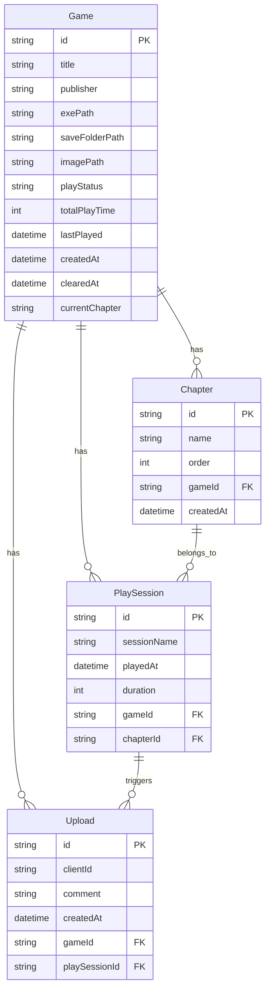
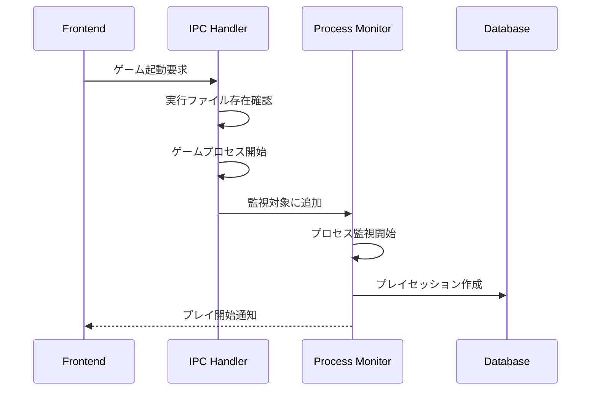
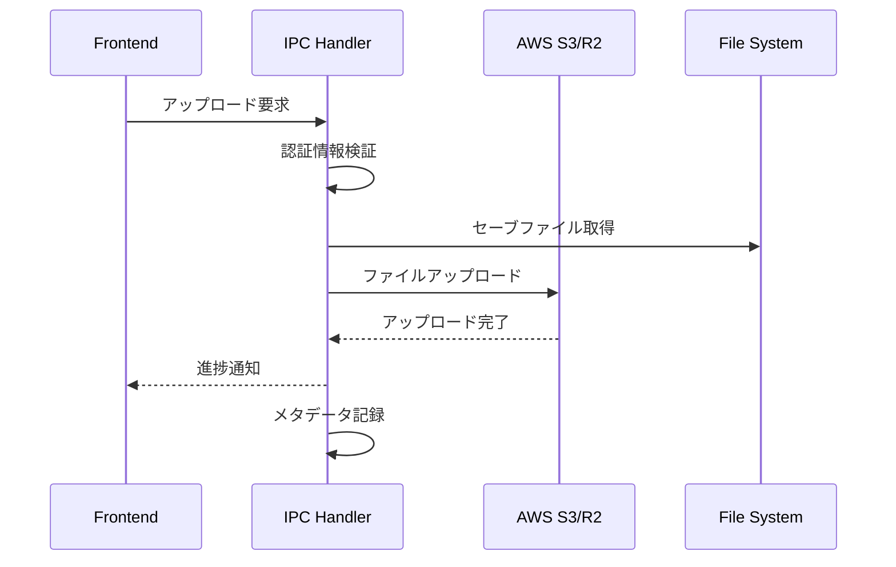
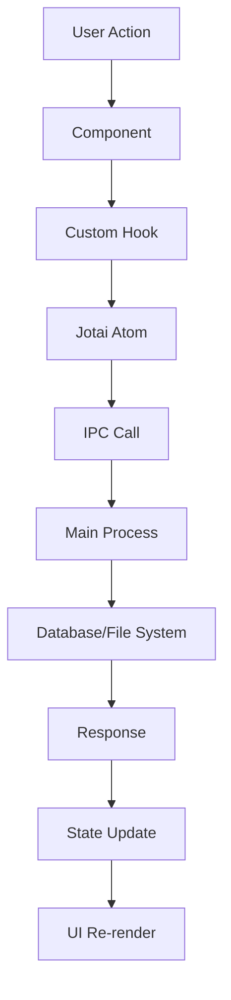

# CloudLaunch システム仕様書

## 目次

1. [システム概要](#システム概要)
2. [アーキテクチャ](#アーキテクチャ)
3. [技術スタック](#技術スタック)
4. [ディレクトリ構成](#ディレクトリ構成)
5. [機能仕様](#機能仕様)
6. [データフロー](#データフロー)
7. [セキュリティ](#セキュリティ)
8. [パフォーマンス](#パフォーマンス)
9. [運用・保守](#運用保守)

## 関連ドキュメント

- [ドキュメント索引](./DOCUMENTATION_INDEX.md) - 全ドキュメントの構造と関係
- [API仕様書](./API_SPECIFICATION.md) - IPC通信の詳細仕様
- [コンポーネント仕様書](./COMPONENT_SPECIFICATION.md) - フロントエンド設計
- [データベース仕様書](./DATABASE_SPECIFICATION.md) - データ設計・運用
- [型システムガイド](./TYPE_SYSTEM_GUIDE.md) - TypeScript型運用
- [コーディング規約](./CODING_GUIDELINES.md) - 開発ルール
- [開発ワークフロー](./DEVELOPMENT_WORKFLOW.md) - 実装手順

## システム概要

### プロジェクト名

CloudLaunch

### 概要

Electronベースのゲームランチャーアプリケーション。ゲームの管理、プレイ時間の自動計測、セーブデータのクラウド同期機能を提供。

### 主要機能

- ゲーム管理（登録、編集、削除、検索）
- 自動プレイ時間計測
- 章別プレイ進捗管理
- セーブデータのクラウド同期（AWS S3/R2）
- プレイセッション記録・分析
- **プレイメモ機能**（Markdown形式でのメモ作成・管理）
- **メモクラウド同期**（メモのクラウドストレージ連携）
- オフラインモード対応

### 対象プラットフォーム

- Windows 10/11
- macOS (Intel/Apple Silicon)
- Linux (Ubuntu/CentOS)

## アーキテクチャ

### 全体アーキテクチャ

```
┌─────────────────────────────────────────────────────────┐
│                    Electron App                         │
├─────────────────────────────────────────────────────────┤
│  Renderer Process (React Frontend)                     │
│  ┌─────────────┐ ┌─────────────┐ ┌─────────────┐      │
│  │    Pages    │ │ Components  │ │   Hooks     │      │
│  └─────────────┘ └─────────────┘ └─────────────┘      │
│                        │                               │
│                        ▼                               │
│  ┌─────────────────────────────────────────────────┐  │
│  │              IPC Bridge                         │  │
│  └─────────────────────────────────────────────────┘  │
├─────────────────────────────────────────────────────────┤
│  Main Process (Node.js Backend)                        │
│  ┌─────────────┐ ┌─────────────┐ ┌─────────────┐      │
│  │IPC Handlers │ │  Services   │ │   Utils     │      │
│  └─────────────┘ └─────────────┘ └─────────────┘      │
│                        │                               │
│                        ▼                               │
│  ┌─────────────┐ ┌─────────────┐ ┌─────────────┐      │
│  │   Prisma    │ │  File I/O   │ │Process Mon. │      │
│  │   (SQLite)  │ │             │ │             │      │
│  └─────────────┘ └─────────────┘ └─────────────┘      │
├─────────────────────────────────────────────────────────┤
│  External Dependencies                                  │
│  ┌─────────────┐ ┌─────────────┐ ┌─────────────┐      │
│  │ AWS S3/R2   │ │   OS APIs   │ │File System │      │
│  └─────────────┘ └─────────────┘ └─────────────┘      │
└─────────────────────────────────────────────────────────┘
```

### プロセス間通信（IPC）アーキテクチャ

```
Renderer Process          Preload Script           Main Process
┌─────────────┐          ┌─────────────┐          ┌─────────────┐
│ React       │   IPC    │ Exposed     │  Native  │ IPC         │
│ Components  │ ────────▶│ APIs        │ ────────▶│ Handlers    │
│             │          │ (Security   │          │             │
│ State       │◀────────  │  Bridge)    │◀────────  │ Services    │
│ Management  │   Data   │             │ Response │             │
└─────────────┘          └─────────────┘          └─────────────┘
```

## 技術スタック

### フロントエンド

| 技術            | バージョン | 用途             |
| --------------- | ---------- | ---------------- |
| React           | 19.1.0     | UIライブラリ     |
| TypeScript      | 5.8.3      | 型安全性         |
| Tailwind CSS    | 4.1.10     | スタイリング     |
| DaisyUI         | 5.0.43     | UIコンポーネント |
| React Router    | 7.6.2      | ルーティング     |
| Jotai           | 2.12.5     | 状態管理         |
| React Hot Toast | 2.5.2      | 通知             |
| React Icons     | 5.5.0      | アイコン         |
| React MD Editor | 4.0.7      | Markdownエディタ |
| React Markdown  | 10.1.0     | Markdown表示     |

### バックエンド

| 技術             | バージョン | 用途                   |
| ---------------- | ---------- | ---------------------- |
| Electron         | 35.1.5     | デスクトップアプリ基盤 |
| Node.js          | -          | ランタイム             |
| Prisma           | 6.11.0     | ORM                    |
| SQLite           | 5.1.7      | データベース           |
| AWS SDK          | 3.828.0    | S3/R2クライアント      |
| ps-list          | 8.1.1      | プロセス監視           |
| keytar           | 7.9.0      | 認証情報管理           |
| electron-store   | 10.1.0     | 設定管理               |
| electron-updater | 6.3.9      | 自動更新               |
| file-type        | 21.0.0     | ファイル形式判定       |
| csv-parse        | 6.1.0      | CSVパーサー            |

### 開発・ビルドツール

| 技術          | バージョン | 用途                     |
| ------------- | ---------- | ------------------------ |
| electron-vite | 3.1.0      | ビルドツール             |
| Vite          | 6.2.6      | 開発サーバー             |
| ESLint        | 9.24.0     | コード品質               |
| Prettier      | 3.5.3      | コードフォーマット       |
| Jest          | 30.0.4     | テスト（Node.js）        |
| Vitest        | 3.2.4      | テスト（フロントエンド） |

## ディレクトリ構成

```
cloudlaunch/
├── docs/                           # ドキュメント
│   ├── CODING_GUIDELINES.md
│   ├── DEVELOPMENT_WORKFLOW.md
│   ├── TYPE_SYSTEM_GUIDE.md
│   └── SYSTEM_SPECIFICATION.md
├── prisma/                         # データベース関連
│   ├── migrations/                 # マイグレーションファイル
│   ├── schema.prisma              # スキーマ定義
│   └── seed.ts                    # シードデータ
├── resources/                      # 静的リソース
├── src/
│   ├── constants/                  # 定数定義
│   │   ├── config.ts
│   │   ├── messages.ts
│   │   ├── patterns.ts
│   │   └── index.ts
│   ├── main/                       # Electron メインプロセス
│   │   ├── ipcHandlers/           # IPC通信ハンドラー
│   │   │   ├── chapterHandlers.ts
│   │   │   ├── cloudDataHandlers.ts
│   │   │   ├── credentialHandlers.ts
│   │   │   ├── databaseHandlers.ts
│   │   │   ├── memoHandlers.ts           # メモ管理
│   │   │   ├── downloadHandler.ts
│   │   │   ├── uploadSaveDataFolderHandlers.ts
│   │   │   └── ...
│   │   ├── service/               # ビジネスロジック
│   │   │   ├── credentialService.ts
│   │   │   ├── processMonitorService.ts
│   │   │   ├── memoService.ts            # メモサービス
│   │   │   ├── cloudMemoService.ts       # クラウドメモサービス
│   │   │   ├── memoSyncService.ts        # メモ同期サービス
│   │   │   └── ...
│   │   ├── utils/                 # ユーティリティ
│   │   │   ├── errorHandler.ts
│   │   │   ├── logger.ts
│   │   │   ├── memoFileManager.ts        # メモファイル管理
│   │   │   ├── cloudStorageHelper.ts
│   │   │   └── ...
│   │   ├── db.ts                  # データベース設定
│   │   ├── index.ts               # メインエントリーポイント
│   │   └── registerHandlers.ts    # IPCハンドラー登録
│   ├── preload/                   # セキュリティブリッジ
│   │   ├── api/                   # API定義
│   │   │   ├── memoPreload.ts           # メモAPI
│   │   │   ├── chapterPreload.ts
│   │   │   └── ...
│   │   └── index.ts
│   ├── renderer/                  # React フロントエンド
│   │   └── src/
│   │       ├── components/        # UIコンポーネント
│   │       │   ├── CloudTreeNode.tsx     # クラウドツリー表示
│   │       │   ├── CloudItemCard.tsx     # クラウドアイテム
│   │       │   ├── CloudHeader.tsx       # クラウドヘッダー
│   │       │   ├── ConfirmModal.tsx      # 確認モーダル
│   │       │   ├── DynamicImage.tsx      # 動的画像読み込み
│   │       │   └── ...
│   │       ├── hooks/            # カスタムフック
│   │       │   ├── useMemoNavigation.ts  # メモナビゲーション
│   │       │   ├── useMemoOperations.ts  # メモ操作
│   │       │   ├── useValidCreds.ts      # 認証情報検証
│   │       │   └── ...
│   │       ├── pages/            # ページコンポーネント
│   │       │   ├── MemoCreate.tsx        # メモ作成
│   │       │   ├── MemoEditor.tsx        # メモ編集
│   │       │   ├── MemoList.tsx          # メモ一覧
│   │       │   ├── MemoView.tsx          # メモ表示
│   │       │   └── ...
│   │       ├── state/            # 状態管理
│   │       └── utils/            # フロントエンドユーティリティ
│   ├── types/                     # 型定義
│   │   ├── common.ts
│   │   ├── game.d.ts
│   │   ├── memo.d.ts                    # メモ関連型
│   │   ├── result.d.ts
│   │   ├── validation.ts               # バリデーション型
│   │   ├── path.ts                     # パス関連型
│   │   └── ...
│   └── utils/                     # 共通ユーティリティ
├── package.json
└── ...設定ファイル
```

## 機能仕様

### 1. ゲーム管理機能

#### ゲーム登録

- **入力**: タイトル、出版社、実行ファイルパス、セーブフォルダパス（任意）、画像パス（任意）
- **処理**:
  - バリデーション実行
  - データベースに保存
  - UUID自動生成
- **出力**: 登録完了通知

### 5. プレイメモ機能

#### メモ作成・編集

- **入力**: タイトル、Markdown形式コンテンツ、ゲームID
- **処理**:
  - データベースに保存
  - ローカルファイルシステムに同期
  - UUID自動生成
- **出力**: メモ作成・更新完了通知

#### メモ管理

- **一覧表示**: ゲーム別メモ一覧
- **検索・フィルタ**: タイトル・内容による検索
- **ファイル連携**: ローカルファイルとの同期
- **プレビュー**: Markdownのリアルタイムプレビュー

#### クラウド同期

- **アップロード**: S3/R2ストレージへのメモ保存
- **ダウンロード**: クラウドからのメモ取得
- **双方向同期**: ローカル・クラウド間の変更検出と同期
- **競合解決**: 同時編集時の競合処理

### 6. ファイル管理機能

#### 動的画像読み込み

- **遅延読み込み**: Intersection Observerによる最適化
- **フォールバック**: エラー時のデフォルト画像表示
- **キャッシュ**: ロードした画像のメモリキャッシュ

#### ファイル形式検証

- **ファイルタイプ判定**: file-typeライブラリによる検証
- **セキュリティ**: 不正ファイルの検出・拒否

#### ゲーム編集

- **入力**: ゲームID、更新データ
- **処理**: 既存データの更新
- **出力**: 更新完了通知

#### ゲーム削除

- **入力**: ゲームID
- **処理**:
  - 関連するプレイセッション、章データも削除
  - カスケード削除実行
- **出力**: 削除完了通知

#### ゲーム検索・フィルタリング

- **入力**: 検索クエリ、プレイステータス、並び順
- **処理**:
  - デバウンス処理（300ms）
  - 部分一致検索
  - ステータスフィルタリング
- **出力**: フィルタリング済みゲーム一覧

### 2. プレイ時間自動計測機能

#### プロセス監視システム

```typescript
interface MonitoredGame {
  gameId: string
  gameTitle: string
  exePath: string
  exeName: string
  lastDetected?: Date
  playStartTime?: Date
  accumulatedTime: number
  lastNotFound?: Date
}
```

#### 監視フロー

1. **プロセス検出**: 2秒間隔でプロセス一覧を取得
2. **ゲーム判定**: 実行ファイルパスとプロセス名で照合
3. **セッション開始**: プロセス検出時にタイマー開始
4. **セッション終了**: 4秒間プロセス未検出でタイマー停止
5. **データ保存**: セッション終了時にデータベースへ保存

#### プロセス最適化

- プロセス一覧を10秒間キャッシュ
- 最大1000件のプロセス制限
- Unicode正規化による日本語対応

### 3. 章別プレイ進捗管理

#### 章データ構造

```typescript
interface Chapter {
  id: string
  name: string
  order: number
  gameId: string
  createdAt: Date
}
```

#### 章管理機能

- 章の作成・編集・削除
- 章の順序変更（ドラッグ&ドロップ）
- 現在プレイ中の章設定
- 章別統計情報表示

### 4. クラウド同期機能

#### 対応ストレージ

- AWS S3
- Cloudflare R2
- S3互換ストレージ

#### 同期フロー

1. **認証情報設定**: アクセスキー、シークレットキー、バケット名
2. **アップロード**:
   - セーブフォルダを再帰的にスキャン
   - ファイル単位でアップロード
   - 進捗表示
3. **ダウンロード**:
   - クラウドファイル一覧表示
   - 選択的ダウンロード
   - 上書き確認

#### セキュリティ

- 認証情報はOSキーチェーン（keytar）で暗号化保存
- パストラバーサル攻撃対策
- ファイルサイズ制限

### 5. データベース設計

#### ERD



## データフロー

### 1. ゲーム起動フロー



### 2. クラウド同期フロー



### 3. 状態管理フロー



## セキュリティ

### 1. Electronセキュリティ

#### Context Isolation

- レンダラープロセスからのNode.js APIアクセスを制限
- preloadスクリプトによる安全なAPI公開

#### セキュア設定

```typescript
// メインプロセス
const mainWindow = new BrowserWindow({
  webPreferences: {
    nodeIntegration: false, // Node.js統合無効
    contextIsolation: true, // コンテキスト分離有効
    enableRemoteModule: false, // remoteモジュール無効
    preload: path.join(__dirname, "../preload/index.js")
  }
})
```

### 2. 認証情報管理

#### keytar使用

```typescript
// 認証情報の暗号化保存
await keytar.setPassword("cloudlaunch", "aws-credentials", JSON.stringify(credentials))

// 認証情報の復号化取得
const encrypted = await keytar.getPassword("cloudlaunch", "aws-credentials")
```

#### セキュリティポリシー

- 認証情報は平文でファイル保存しない
- メモリ上での認証情報は使用後即座にクリア
- デバッグログに認証情報を出力しない

### 3. ファイルアクセス制御

#### パストラバーサル対策

```typescript
// 不正なパスの検証
if (remotePath.includes("..") || remotePath.startsWith("/")) {
  return { success: false, message: "不正なパスが指定されました" }
}
```

#### ファイル検証

```typescript
// ファイルタイプ検証
const fileType = await import("file-type")
const type = await fileType.fromFile(filePath)
```

## パフォーマンス

### 1. フロントエンド最適化

#### React最適化

- `React.memo`によるコンポーネントメモ化
- `useMemo`、`useCallback`による再計算防止
- 仮想化によるリスト表示最適化

#### 状態管理最適化

- Jotaiによる細粒度状態管理
- 不要な再レンダリング防止

#### バンドル最適化

- Code Splitting実装
- Tree Shaking有効化
- 動的インポート活用

### 2. バックエンド最適化

#### データベース最適化

```sql
-- インデックス設定
CREATE INDEX idx_games_title ON Game(title);
CREATE INDEX idx_playsessions_gameid ON PlaySession(gameId);
CREATE INDEX idx_chapters_gameid_order ON Chapter(gameId, order);
```

#### プロセス監視最適化

- プロセス一覧の10秒キャッシュ
- 最大1000件のプロセス制限
- 非アクティブゲームの自動クリーンアップ

#### ファイル操作最適化

- ストリーミングアップロード
- チャンク分割による大容量ファイル対応
- 並列処理による高速化

### 3. メモリ管理

#### ガベージコレクション対策

- 大きなオブジェクトの適切な解放
- イベントリスナーのクリーンアップ
- タイマーの適切な停止

## 運用・保守

### 1. ログ管理

#### ログレベル

- `DEBUG`: 開発時のデバッグ情報
- `INFO`: 通常の動作ログ
- `WARN`: 警告レベルの情報
- `ERROR`: エラー情報

#### ログ出力

```typescript
// ログ設定
export const logger = {
  debug: (message: string, data?: unknown) => {
    if (isDevelopment) {
      console.log(`[DEBUG] ${message}`, data ?? "")
    }
  },
  info: (message: string, data?: unknown) => {
    console.log(`[INFO] ${message}`, data ?? "")
  },
  warn: (message: string, data?: unknown) => {
    console.warn(`[WARN] ${message}`, data ?? "")
  },
  error: (message: string, error?: unknown, data?: unknown) => {
    console.error(`[ERROR] ${message}`, error ?? "", data ?? "")
  }
}
```

### 2. エラーハンドリング

#### 統一エラー形式

```typescript
export type ApiResult<T = void> = { success: true; data?: T } | { success: false; message: string }
```

#### エラー処理パターン

```typescript
// バックエンド
export function createErrorResult(error: Error | AppError | unknown, context?: string): ApiResult {
  // エラー情報の正規化と安全な処理
}

// フロントエンド
export function handleApiError<T = void>(
  result: ApiResult<T>,
  fallbackMessage: string = "エラーが発生しました",
  toastId?: string
): void {
  // 統一的なエラー表示処理
}
```

### 3. テスト戦略

#### テスト構成

- **Unit Test**: Jest（バックエンド）、Vitest（フロントエンド）
- **Integration Test**: IPCハンドラーのテスト
- **E2E Test**: 主要ワークフローの自動テスト

#### テストカバレッジ目標

- Line Coverage: 80%以上
- Function Coverage: 90%以上
- Branch Coverage: 75%以上

### 4. 更新・デプロイ

#### electron-updater設定

```typescript
// 自動更新設定
import { autoUpdater } from "electron-updater"

autoUpdater.checkForUpdatesAndNotify()
```

#### ビルド設定

```yaml
# electron-builder.yml
directories:
  output: dist
files:
  - "!**/.vscode/*"
  - "!src/*"
  - "!electron.vite.config.{js,ts,mjs,cjs}"
  - "!{.eslintignore,.eslintrc.cjs,.prettierignore,.prettierrc.yaml,dev-app-update.yml,CHANGELOG.md,README.md}"
  - "!{.env,.env.*,.npmrc,pnpm-lock.yaml}"
  - "!{tsconfig.json,tsconfig.node.json,tsconfig.web.json}"
```

### 5. 設定管理

#### electron-store使用

```typescript
// 設定の永続化
const store = new Store({
  defaults: {
    autoTracking: true,
    theme: "system",
    language: "ja"
  }
})
```

#### 設定項目

- `autoTracking`: 自動プレイ時間計測の有効/無効
- `theme`: テーマ設定（light/dark/system）
- `language`: 言語設定
- `windowBounds`: ウィンドウサイズ・位置

## トラブルシューティング

### 1. よくある問題と解決方法

#### プロセス監視が動作しない

- 管理者権限の確認
- セキュリティソフトによるブロック確認
- ログファイルの確認

#### クラウド同期エラー

- 認証情報の確認
- ネットワーク接続の確認
- バケット権限の確認

#### データベースエラー

- ファイル権限の確認
- ディスク容量の確認
- マイグレーション状態の確認

### 2. デバッグ方法

#### 開発者ツール

```typescript
// 開発環境でのデバッガー起動
if (isDevelopment) {
  mainWindow.webContents.openDevTools()
}
```

#### ログファイル場所

- Windows: `%APPDATA%/cloud_launch/logs`
- macOS: `~/Library/Logs/cloud_launch`
- Linux: `~/.config/cloud_launch/logs`

### 3. パフォーマンス監視

#### メトリクス収集

- CPU使用率
- メモリ使用量
- ディスクI/O
- ネットワークトラフィック

## まとめ

このシステム仕様書は、CloudLaunchの技術的詳細と運用方針を定義しています。新機能の追加や保守作業の際は、この仕様に従って実装してください。

不明な点や追加の詳細が必要な場合は、個別のドキュメント（API仕様書、コンポーネント仕様書等）を参照してください。
